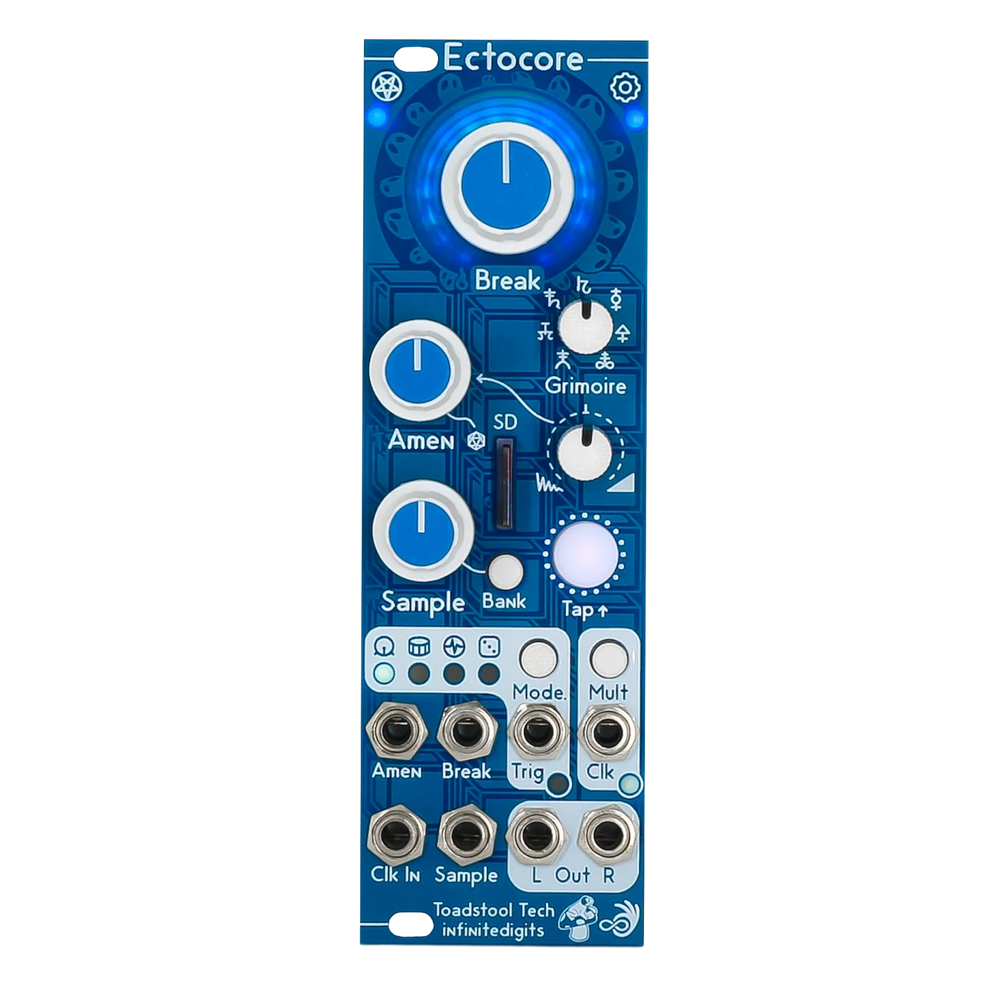

# `_core`

 

this is the monorepo for [zeptocore](https://zeptocore.com), [zeptoboard](https://zeptocore.com/#zeptoboard), ectocore, and [ezeptocore](https://get.ezeptocore.com) music devices, their documentation, their firmware, and the tools to interact with them.

for information about purchasing and documentation, visit [zeptocore.com](https://zeptocore.com). demos are available [on youtube](https://www.youtube.com/watch?v=FZ2C9VIMgeI&list=PLCNN6FnBNdpWQUyHAQO_wCQkbMl95-293).

## dsp

The digital signal processing for all the *core things was written by Zack, from scratch, in C. This was done partially to have strict control over the sound/utility, but also because the RP2040 is fixed-point based and needed special care in all the DSP. The libraries are written with modularity in mind, so [they can be used in other programs](https://github.com/schollz/fpfx). Here are the DSP header files:

- [beat repeat](https://github.com/schollz/_core/blob/main/lib/beatrepeat.h) based on zero-crossings
- [bit crush](https://github.com/schollz/_core/blob/main/lib/bitcrush.h) with sample rate and bit rate modulation
- [comb filter](https://github.com/schollz/_core/blob/main/lib/comb.h) tuned for some cool chaotic sounds and stereo field
- [simple delay](https://github.com/schollz/_core/blob/main/lib/delay.h)
- [reverb stereo](https://github.com/schollz/_core/blob/main/lib/freeverb_fp.h) and [reverb mono](https://github.com/schollz/_core/blob/main/lib/freeverb_fp_mono.h) (stereo takes too much cpu)
- [distortion/fuzz](https://github.com/schollz/_core/blob/main/lib/fuzz.py), this is a meta code file that generates the header
- [reampling](https://github.com/schollz/_core/blob/main/lib/array_resample.h) with linear and quadratic forms
- [resonant filter](https://github.com/schollz/_core/blob/main/lib/resonantfilter.h) which has a fade-in/out
- [saturation](https://github.com/schollz/_core/blob/main/lib/saturation.h)
- [shapers](https://github.com/schollz/_core/blob/main/lib/shaper.h) for a loss-type effect
- [tape delay](https://github.com/schollz/_core/blob/main/lib/tapedelay.h) 
- [transfer](https://github.com/schollz/_core/blob/main/lib/transfer.h) which can also be used for wave shaping

## zeptocore

the zeptocore device is a versatile, open-source, handmade audio player and synthesizer, featuring stereo playback of 16-bit audio files at a 44.1 kHz sampling rate. 

the zeptocore supports SD-card storage for up to 32 gigabytes of samples and can recall up to 256 audio files organized into 16 banks of 16 tracks each. the zeptocore has 16 different audio effects - saturation, fuzz, delay, comb, beat repeater, filter, tape stop, reverb + more - and includes a single-cycle wavetable synthesizer. The device offers a real-time sequencer with optional quantization, optional clock sync out, and MIDI (in and out) over USB. the device has a built-in 8-ohm speaker and can be powered by two AAA batteries or USB-C.

The firmware for the zeptocore is written in C, and instructions for building the firmware are in the [documentation](https://zeptocore.com/#firmware-development).

## diy

- [Website](https://zeptocore.com/)
- [Schematic](https://github.com/schollz/_core/blob/main/schematics/zeptocore_v28.pdf)
- [Source code](https://github.com/schollz/_core)
- [Firmware](https://zeptocore.com/#uploading-firmware)
- [Instructions for uploading firmware](https://zeptocore.com/#instructions) 
- [Video demonstration](https://www.youtube.com/watch?v=WBvos0TkcSY)
- [Video DIY guide](https://www.youtube.com/watch?v=FH1R4RCh0vU)

## EZEPTOCORE

The EZEPTOCORE is a eurorack version of the zeptocore developed by Infinite Digits in collaboration with Maneco Labs (full attributions [here](https://infinitedigits.co/posts/eurorack-zeptocore/)).

### EZEPTOCORE firmware 

The firmware is divided into two categories: *overclocking* and *non-overclocking*. 

- Choose *overclocking*  if you are using an external clock and want maximum CPU bandwidth for FX. These builds run faster but can exhibit slight clock drift if not externally synced.
- Choose *non-overclocking*  if you are using the internal clock and need extremely stable timing. These builds have slightly reduced CPU overhead but offer the highest temporal stability.

For latency, normal latency will work for most, but choose low or ultra-low if you encounter latency issues (note: available FX bandwidth decreases for low latency).

|                  | Normal Latency                                                                                            | Low Latency                                                                                                           | Ultra-Low Latency                                                                                                          |
| ---------------- | --------------------------------------------------------------------------------------------------------- | --------------------------------------------------------------------------------------------------------------------- | -------------------------------------------------------------------------------------------------------------------------- |
| Overclocking     | [v7.1.0](https://github.com/schollz/_core/releases/download/v7.1.0/ezeptocore_v7.1.0.uf2)*                | [v7.1.0](https://github.com/schollz/_core/releases/download/v7.1.0/ezeptocore_v7.1.0_low_latency.uf2)                 | [v7.1.0](https://github.com/schollz/_core/releases/download/v7.1.0/ezeptocore_v7.1.0_ultralow_latency.uf2)                 |
| Non-Overclocking | [v7.1.0](https://github.com/schollz/_core/releases/download/v7.1.0/ezeptocore_v7.1.0_no_overclocking.uf2) | [v7.1.0](https://github.com/schollz/_core/releases/download/v7.1.0/ezeptocore_v7.1.0_no_overclocking_low_latency.uf2) | [v7.1.0](https://github.com/schollz/_core/releases/download/v7.1.0/ezeptocore_v7.1.0_no_overclocking_ultralow_latency.uf2) |

*default firmware

### diy

- [Schematic](https://github.com/schollz/_core/blob/main/schematics/ezeptocore-schematic.pdf)
- [Source code](https://github.com/schollz/_core)
- [Firmware](https://github.com/schollz/_core/releases)

## ectocore (discontinued)

the ectocore is the eurorack version of the zeptocore developed by Infinite Digits in collaboration with Toadstool Tech (full attributions [here](https://infinitedigits.co/posts/eurorack-zeptocore/)).

### ectocore firmware 

The firmware is divided into two categories: *overclocking* and *non-overclocking*. 

- Choose *overclocking*  if you are using an external clock and want maximum CPU bandwidth for FX. These builds run faster but can exhibit slight clock drift if not externally synced.
- Choose *non-overclocking*  if you are using the internal clock and need extremely stable timing. These builds have slightly reduced CPU overhead but offer the highest temporal stability.

For latency, normal latency will work for most, but choose low or ultra-low if you encounter latency issues (note: available FX bandwidth decreases for low latency).

|                  | Normal Latency                                                                                          | Low Latency                                                                                                         | Ultra-Low Latency                                                                                                        |
| ---------------- | ------------------------------------------------------------------------------------------------------- | ------------------------------------------------------------------------------------------------------------------- | ------------------------------------------------------------------------------------------------------------------------ |
| Overclocking     | [v6.4.7](https://github.com/schollz/_core/releases/download/v6.4.7/ectocore_v6.4.7.uf2)*                | [v6.4.7](https://github.com/schollz/_core/releases/download/v6.4.7/ectocore_v6.4.7_low_latency.uf2)                 | [v6.4.7](https://github.com/schollz/_core/releases/download/v6.4.7/ectocore_v6.4.7_ultralow_latency.uf2)                 |
| Non-Overclocking | [v6.4.7](https://github.com/schollz/_core/releases/download/v6.4.7/ectocore_v6.4.7_no_overclocking.uf2) | [v6.4.7](https://github.com/schollz/_core/releases/download/v6.4.7/ectocore_v6.4.7_no_overclocking_low_latency.uf2) | [v6.4.7](https://github.com/schollz/_core/releases/download/v6.4.7/ectocore_v6.4.7_no_overclocking_ultralow_latency.uf2) |

### diy

- [Schematic](https://github.com/schollz/_core/blob/main/schematics/ectocore_v1.0.1.pdf)
- [Source code](https://github.com/schollz/_core)
- [Firmware](https://github.com/schollz/_core/releases)
- [Instructions for uploading samples](https://www.youtube.com/watch?v=NfjjhU1z6Ek) 

## zeptoboard

zeptoboard is the breadboard variant of the zeptocore. It has most of the same functionality, but instead of using the buttons on the handheld device, you can utilize your keyboard. This version requires some knowledge of breadboarding, but it is ideal if you want to develop your ideas based on the firmware. more information [here](https://zeptocore.com/#zeptoboard).

# license & attributions

- Apache License 2.0 for no-OS-FatFS (Copyright 2021 Carl John Kugler III)
- MIT license for the SdFat library (Copyright (c) 2011-2022 Bill Greiman)
- MIT license for the USB library (Copyright (c) 2019 Ha Thach)
- GPLv3 for all _core code
- Hardware: cc-by-sa-3.0

## guidelines for derivative works

The schematics are open-source - you are welcome to utilize them to customize the device according to your preferences. If you intend to produce boards based on my schematics, I kindly ask for your financial support to help sustain the development of future devices.
Also note - Infinite Digits and Ectocore are registered trademarks. The name "Infinite Digits" and "Ectocore" should not be used on any of the derivative works you create from these files. 

