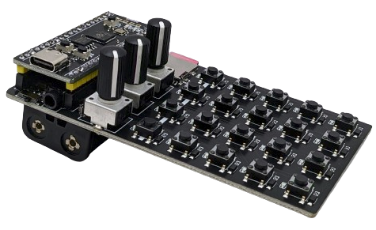
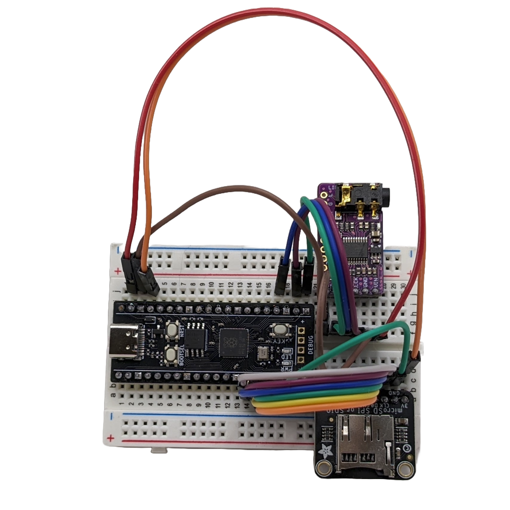
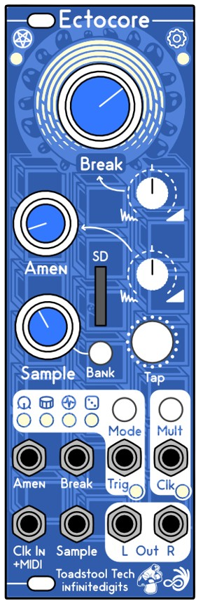
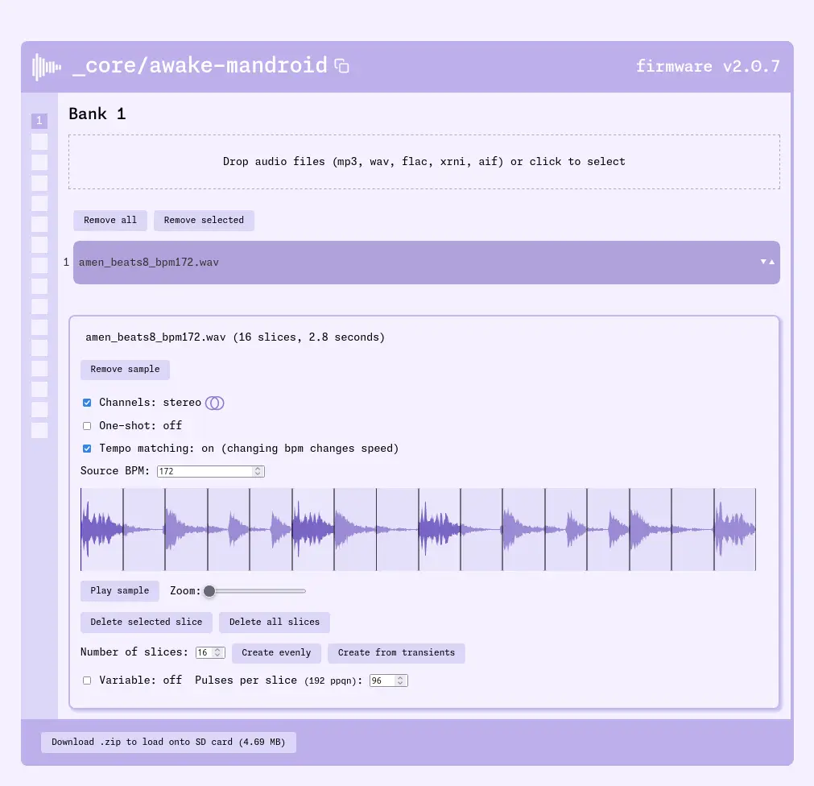
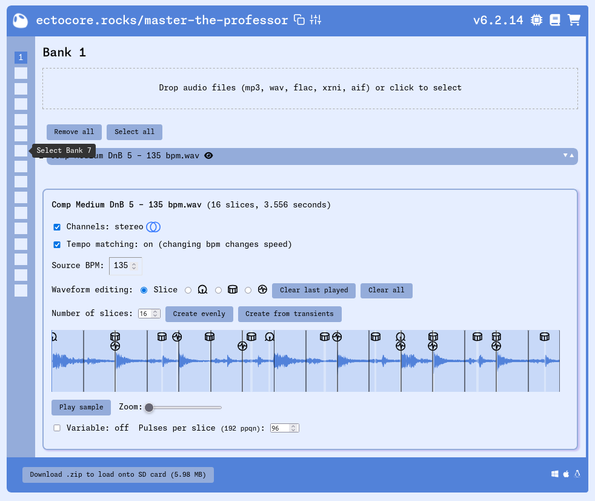

# `_core`

[](https://github.com/schollz/_core/actions/workflows/build.yml) [](https://github.com/schollz/_core/releases/latest)


this is the monorepo for [zeptocore](https://zeptocore.com), [zeptoboard](https://zeptocore.com/#zeptoboard), and [ectocore](https://getectocore.com) music devices, their documentation, their firmware, and the tools to interact with them.

for information about purchasing and documentation, visit [zeptocore.com](https://zeptocore.com). demos are available [on youtube](https://www.youtube.com/watch?v=FZ2C9VIMgeI&list=PLCNN6FnBNdpWQUyHAQO_wCQkbMl95-293).

## dsp

The digital signal processing for all the *core things was written by Zack, from scratch, in C. This was done partially to have strict control over the sound/utility, but also because the RP2040 is fixed-point based and needed special care in all the DSP. The libraries are written with modularity in mind, so [they can be used in other programs](https://github.com/schollz/fpfx). Here are the DSP header files:

- [beat repeat](https://github.com/schollz/_core/blob/main/lib/beatrepeat.h) based on zero-crossings
- [bit crush](https://github.com/schollz/_core/blob/main/lib/bitcrush.h) with sample rate and bit rate modulation
- [comb filter](https://github.com/schollz/_core/blob/main/lib/comb.h) tuned for some cool chaotic sounds and stereo field
- [simple delay](https://github.com/schollz/_core/blob/main/lib/delay.h)
- [reverb stereo](https://github.com/schollz/_core/blob/main/lib/freeverb_fp.h) and [reverb mono](https://github.com/schollz/_core/blob/main/lib/freeverb_fp_mono.h) (stereo takes too much cpu)
- [distortion/fuzz](https://github.com/schollz/_core/blob/main/lib/fuzz.py), this is a meta code file that generates the header
- [reampling](https://github.com/schollz/_core/blob/main/lib/array_resample.h) with linear and quadratic forms
- [resonant filter](https://github.com/schollz/_core/blob/main/lib/resonantfilter.h) which has a fade-in/out
- [saturation](https://github.com/schollz/_core/blob/main/lib/saturation.h)
- [shapers](https://github.com/schollz/_core/blob/main/lib/shaper.h) for a loss-type effect
- [tape delay](https://github.com/schollz/_core/blob/main/lib/tapedelay.h) 
- [transfer](https://github.com/schollz/_core/blob/main/lib/transfer.h) which can also be used for wave shaping

## zeptocore

the zeptocore device is a versatile, open-source, handmade audio player and synthesizer, featuring stereo playback of 16-bit audio files at a 44.1 kHz sampling rate. 

<div align="center">

</div>

the zeptocore supports SD-card storage for up to 32 gigabytes of samples and can recall up to 256 audio files organized into 16 banks of 16 tracks each. the zeptocore has 16 different audio effects - saturation, fuzz, delay, comb, beat repeater, filter, tape stop, reverb + more - and includes a single-cycle wavetable synthesizer. The device offers a real-time sequencer with optional quantization, optional clock sync out, and MIDI (in and out) over USB. the device has a built-in 8-ohm speaker and can be powered by two AAA batteries or USB-C.

The firmware for the zeptocore is written in C, and instructions for building the firmware are in the [documentation](https://zeptocore.com/#firmware-development).

## zeptoboard

the zeptoboard is the breadboard version of the zeptocore. 

<div align="center">

</div>

It retains most of the same functionality but allows you to use your keyboard and a MIDI interface (via [this website](https://zeptocore.com/#computer-keyboard)) instead of the buttons on the handheld device. While this version does require some breadboarding knowledge, it is perfect for developing your ideas based on the firmware.

## ectocore 

the ectocore is the eurorack version of the zeptocore. 

<div align="center">

</div>

this is currently under development and will be released soon. more info at https://getectocore.com/

## sample loading tool

the sample loading tool is a web-based tool (available at [zeptocore.com/tool](https://zeptocore.com/tool) or [ectocore.rocks](https://ectocore.rocks)) that allows you to load samples onto the *_core* devices. it is built with Go, and Vue.

<div align="center">

</div>

the source code is located in the [core folder](https://github.com/schollz/_core/tree/main/core), and information for building the tool is located can be found in [the documentation](https://zeptocore.com/#building-from-source).

### ectocore.rocks offline usage

The ectocore.rocks sample loading tool can be used offline by following the instructions for your system.

<div align="center">

</div>

<details><summary>Windows</summary>

#### Download for Windows: **[x64](https://github.com/schollz/_core/releases/download/v6.2.13/core_windows_v6.2.13.exe)**

Once downloaded, double click on the executable file to run it.

</details>


<details><summary>macOS</summary>

To install the tool on macOS, first open a terminal.

Then, if you are on an Intel-based mac install with:

```
curl -L https://github.com/schollz/_core/releases/download/v6.2.13/core_macos_amd64_v6.2.13 > core_macos
```

Or, if you are on a M1/M2-based mac install with:

```
curl -L https://github.com/schollz/_core/releases/download/v6.2.13/core_macos_aarch64_v6.2.13 > core_macos
```

Then to enable the program by entering this into the terminal:

```
chmod +x core_macos 
xattrc -c core_macos
```

Now to run, you can just type

```
./core_macos
```

A window should pop up in the browser with the offline version of the tool.

</details>


<details><summary>Linux</summary>

#### Download for Linux: **[x64](https://github.com/schollz/_core/releases/download/v6.2.13/core_linux_amd64_v6.2.13)**

After downloading, run it directly from the terminal.

</details>


## faq


### Why is it freezing?

Normally, ectocore and zeptocore should not freeze. 

If you encounter a freeze, it would be helpful to know the following:

> What SD card are you using? If you are using a custom SD card, please try using the stock SD (or [approved SD card](https://github.com/schollz/_core?tab=readme-ov-file#which-sd-card-can-i-use)) card to see if the issue persists. If it does, please answer the following questions.

> How many samples did you load? Even though all 16 banks can be used, the ectocore currently only supports about 150 samples due to recent firmware changes. If you exceed 
> this limit, the device may freeze on start.

> Were effects on or off during the freeze? Try turning off all effects (Break knob fully CCW) and see if the issue persists.

> Are you using custom samples or the stock samples? Try using the [stock samples](https://infinitedigits.co/zeptocore_default_samples_v6.zip) and see if the issue persists.

> Is it a particular sample that causes a freeze or any sample? If a particular sample, please provide the original sample if you can.

> What was the BPM set to?

If it happens a lot, please try using [this firmware](https://github.com/schollz/_core/releases/download/v6.2.19/ectocore_no_overclocking_v6.2.19.uf2) which disables overclocking, allows fewer fx, but should increase the stability.

Please submit an issue with responses to these questions by [clicking here](https://github.com/schollz/_core/issues/new?template=ectocore-freezing.md) or send an email to zack@infinitedigits.co.

If, however, you want to return the device, I completely understand. Please reach out to the seller for a return.

### Why is the ectocore not playing in time?

The ectocore is very good at putting out what you put into it. In many cases, users that experience timing issues are due 
to their samples not being in time (e.g. if you have a sound sample that is 8 beats at 120 bpm it should be 8*60/120 = 4 seconds long) or due to the sample not being sliced well (slices should ideally go right before transients).

The stability of the ectocore varies based on whether you use the internal clock, with or without oversampling, or externally clocked.

In order of stability:

1) Internally clock Ectocore using the non-overclocking firmware (found [here](https://github.com/schollz/_core/releases/download/v6.2.19/ectocore_no_overclocking_v6.2.19.uf2)). This is more stable than my external clock source (Pam's new workout).
2) Externally clock Ectocore using a clock source. Even when Ectocore is overclocked, it follows the clock source very well.
3) Internally clock Ectocore using the overclocking firmware (the default). This is about two times less stable than Pam's clock source.

You can visualize this ordering in the data I collected below, where Ectocore was clocked internally (with or without overclocking) or externally (with Pam's clock source). 


1) Pam's, by itself, without Ectocore, starts to slowly drag (Red line).
2) Ectocore, clocked by Pam's, will stay very close to Pam's (which means it will slowly drag) (Blue line).
3) Ectocore, with the normal firmware (overclocked), internally clocked, will start to get ahead of the tempo, worse than Pam's but not terribly bad (Green line).
4) Ectocore, with the non-overclocked firmware, internally clocked, will be rock steady, more than Pam's or anything else (Purple line). Rock steady means deviating by only 0.5 ms after almost 20 minutes.

If you are still having issues, please submit an issue  by [clicking here](https://github.com/schollz/_core/issues/new?template=ectocore-freezing.md) or send an email to zack@infinitedigits.co.

### Which SD Card can I use?

Please note that not all SD cards are equal. Terms like "high-speed," "A1," or "U3" on the card do not necessarily indicate its actual speed performance.

Below is a list of known good and bad cards:

#### Known bad cards

Do *not* use these cards! They may appear to work, but they can cause spurious glitches.

- Lexar brand
- Kootion brand
- Sandisk Ultra
- Kingston brand
- 5% of JUANWE cards

#### Known good cards

- Gigastone 16GB + 32GB
- SP Elite
- SanDisk Extreme
- Samsung EVO
- PNY Elite
- MicroCenter


# license

- Apache License 2.0 for no-OS-FatFS (Copyright 2021 Carl John Kugler III)
- MIT license for the SdFat library (Copyright (c) 2011-2022 Bill Greiman)
- MIT license for the USB library (Copyright (c) 2019 Ha Thach)
