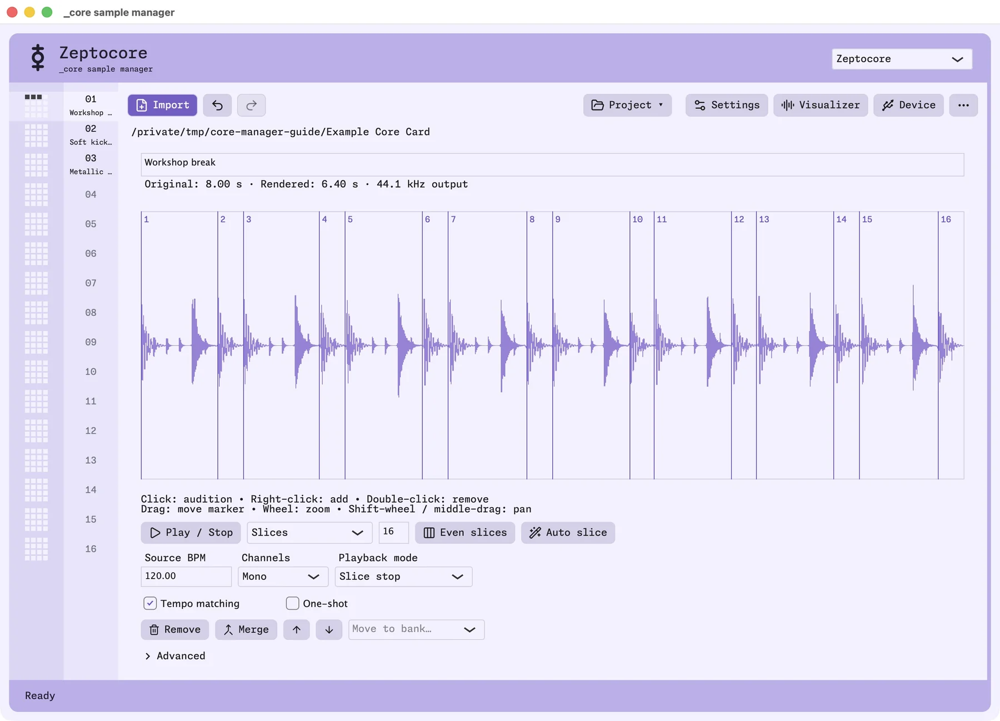
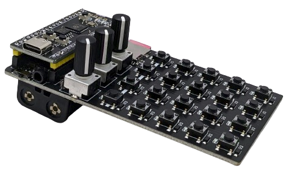
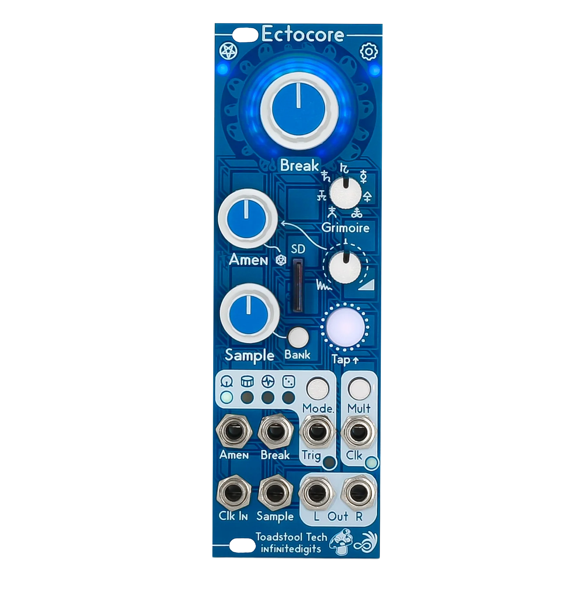
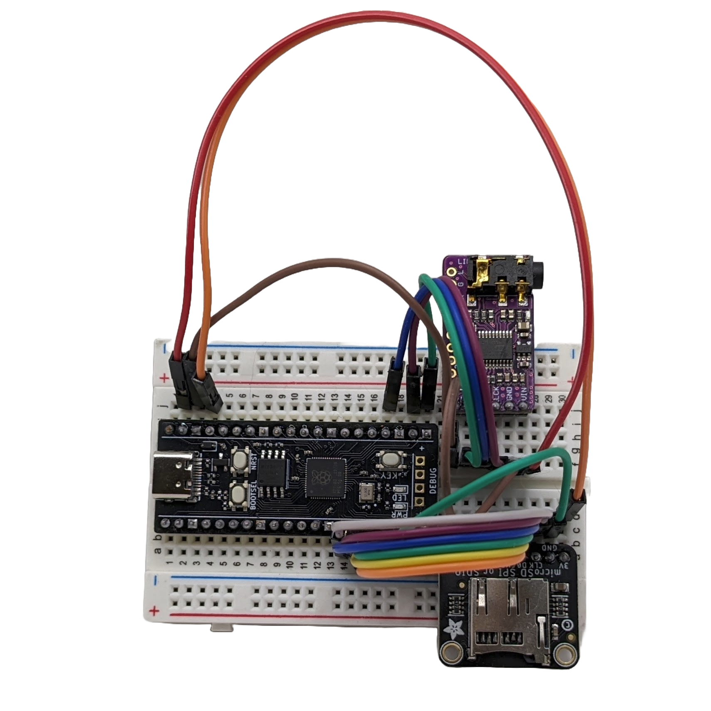

# `_core`

 

this is the monorepo for [zeptocore](https://shop.infinitedigits.co/collections/zeptocore/), [zeptoboard](https://shop.infinitedigits.co/guides/zeptocore/#zeptocore-zeptoboard), ectocore, and [ezeptocore](https://get.ezeptocore.com) music devices, their firmware, and the tools to interact with them.

for purchasing, visit the [Zeptocore collection](https://shop.infinitedigits.co/collections/zeptocore/). complete maintained documentation is available in the [guides](https://shop.infinitedigits.co/guides/). prepare samples with the [Zeptocore tool](https://tool.zeptocore.com/). demos are available [on youtube](https://www.youtube.com/watch?v=FZ2C9VIMgeI&list=PLCNN6FnBNdpWQUyHAQO_wCQkbMl95-293).

For contributors and coding agents, start with the [repository documentation
index](docs/README.md): repository layout, build and test commands, current
firmware behavior, and the consolidated seek/audio development notes.

For releases, use **Actions → Release new version** to bump versions, commit, publish
firmware, and attach Windows packages. See the [release guide](docs/releases.md)
for manual macOS/Linux uploads and retries.

## dsp

The digital signal processing for all the *core things was written by Zack, from scratch, in C. This was done partially to have strict control over the sound/utility, but also because the RP2040 is fixed-point based and needed special care in all the DSP. The libraries are written with modularity in mind, so [they can be used in other programs](https://github.com/schollz/fpfx). Here are the DSP header files:

- [beat repeat](https://github.com/schollz/_core/blob/main/lib/beatrepeat.h) based on zero-crossings
- [bit crush](https://github.com/schollz/_core/blob/main/lib/bitcrush.h) with sample rate and bit rate modulation
- [comb filter](https://github.com/schollz/_core/blob/main/lib/comb.h) tuned for some cool chaotic sounds and stereo field
- [simple delay](https://github.com/schollz/_core/blob/main/lib/delay.h)
- [reverb stereo](https://github.com/schollz/_core/blob/main/lib/freeverb_fp.h) and [reverb mono](https://github.com/schollz/_core/blob/main/lib/freeverb_fp_mono.h) (stereo takes too much cpu)
- [distortion/fuzz](https://github.com/schollz/_core/blob/main/lib/fuzz.py), this is a meta code file that generates the header
- [reampling](https://github.com/schollz/_core/blob/main/lib/array_resample.h) with linear and quadratic forms
- [resonant filter](https://github.com/schollz/_core/blob/main/lib/resonantfilter.h) which has a fade-in/out
- [saturation](https://github.com/schollz/_core/blob/main/lib/saturation.h)
- [shapers](https://github.com/schollz/_core/blob/main/lib/shaper.h) for a loss-type effect
- [tape delay](https://github.com/schollz/_core/blob/main/lib/tapedelay.h) 
- [transfer](https://github.com/schollz/_core/blob/main/lib/transfer.h) which can also be used for wave shaping

## `_core` sample manager and visualizer

The [_core sample manager](https://shop.infinitedigits.co/guides/sample-manager/) is a native app for macOS, Windows, and Linux that prepares Zeptocore, EZEPTOCORE, and Ectocore SD cards offline. It imports sounds, organizes banks, edits slices and tempo, and saves audio and settings directly to your card or project folder, with a built-in firmware installer. The [Zeptocore](https://zeptocore.com/tool), [EZEPTOCORE](https://ezeptocore.com/), and [Ectocore](https://ectocore.rocks/) web managers remain available, and their downloads also work in the desktop app.

The current source uses granular Time Stretch up to **16×**, with an **8×**
triggered effect. New sample-manager and web-tool exports contain primary audio
only. Update device firmware to the matching granular-only build before using
these exports; earlier release downloads may still require companions. Existing
cards work without regeneration, and old companion files are left unused.

It also has a built-in visualizer:

Download the best version for your system:

| Platform | Download |
| --- | --- |
| macOS (Apple Silicon) | [v8.0.6 ZIP](https://github.com/schollz/_core/releases/download/v8.0.6/_core-sample-manager-8.0.6-macos-arm64.zip) |
| macOS (Intel) | [v8.0.6 ZIP](https://github.com/schollz/_core/releases/download/v8.0.6/_core-sample-manager-8.0.6-macos-x86_64.zip) |
| Windows (x64) | [v8.0.6 ZIP](https://github.com/schollz/_core/releases/download/v8.0.6/_core-sample-manager-8.0.6-windows-x64.zip) |
| Linux (x86_64) | [v8.0.6 tar.gz](https://github.com/schollz/_core/releases/download/v8.0.6/_core-sample-manager-8.0.6-linux-x86_64.tar.gz) |

The managers' **Start tempo** setting lets every hardware model start at a fixed
30–300 BPM. Default keeps the existing startup behavior; Fixed BPM overrides any
saved tempo at startup. Normal tempo controls still work afterward. VCV Rack reads
the same setting and exposes it in its Device settings menu. See the
[sample manager settings](sample-manager/README.md) and [Rack guide](rack/README.md)
for details. Hardware requires firmware with Start tempo support.

## VCV Rack modules

The Infinite Digits plugin brings the EZEPTOCORE and Ectocore modules to VCV Rack 2,
using the same DSP as the hardware. Load samples prepared with the sample manager
and play them in a Rack patch. See the [Rack guide](rack/README.md) for installation
and module controls. Requires VCV Rack 2.6.6 or a later compatible Rack 2 release.

Download the ZIP for your system. The plugin keeps its own Rack 2 version; each
package below is attached to the current firmware release. macOS and Linux
packages are uploaded manually, so their links may await an upload after a release.

<!-- rack-downloads:start -->
| Platform | Download |
| --- | --- |
| macOS (Apple Silicon) | [v2.0.1 ZIP](https://github.com/schollz/_core/releases/download/v8.0.6/InfiniteDigits-2.0.1-mac-arm64.zip) |
| macOS (Intel) | [v2.0.1 ZIP](https://github.com/schollz/_core/releases/download/v8.0.6/InfiniteDigits-2.0.1-mac-x64.zip) |
| Windows (x64) | [v2.0.1 ZIP](https://github.com/schollz/_core/releases/download/v8.0.6/InfiniteDigits-2.0.1-win-x64.zip) |
| Linux (x86_64) | [v2.0.1 ZIP](https://github.com/schollz/_core/releases/download/v8.0.6/InfiniteDigits-2.0.1-lin-x64.zip) |
<!-- rack-downloads:end -->

## zeptocore

the zeptocore device is a versatile, open-source, handmade audio player and synthesizer, featuring stereo playback of 16-bit audio files at a 44.1 kHz sampling rate. 

[Read the Zeptocore guide](https://shop.infinitedigits.co/guides/zeptocore/).

the zeptocore supports SD-card storage for up to 32 gigabytes of samples and can recall up to 256 audio files organized into 16 banks of 16 tracks each. the zeptocore has 16 different audio effects - saturation, fuzz, delay, comb, beat repeater, filter, tape stop, reverb + more - and includes a single-cycle wavetable synthesizer. The device offers a real-time sequencer with optional quantization, optional clock sync out, and MIDI input and [MIDI output](https://www.youtube.com/watch?v=Rl_LBdM1FQw) over USB. the device has a built-in 8-ohm speaker and can be powered by two AAA batteries or USB-C.

The firmware for the zeptocore is written in C, and instructions for building it are in the [documentation](https://shop.infinitedigits.co/guides/zeptocore/#zeptocore-firmware).

### zeptocore firmware

| Normal | Low latency | Visualizer |
| --- | --- | --- |
| [v8.0.6 UF2](https://github.com/schollz/_core/releases/download/v8.0.6/zeptocore_v8.0.6.uf2) | [v8.0.6 UF2](https://github.com/schollz/_core/releases/download/v8.0.6/zeptocore_v8.0.6_low_latency.uf2) | [v8.0.6 UF2](https://github.com/schollz/_core/releases/download/v8.0.6/zeptocore_v8.0.6_visualizer.uf2) |

Normal suits most uses; low latency reduces available FX bandwidth. Choose visualizer firmware to use the visualizer below.

## diy

- [Guide](https://shop.infinitedigits.co/guides/zeptocore/)
- [Schematic](https://github.com/schollz/_core/blob/main/schematics/zeptocore_v28.pdf)
- [Source code](https://github.com/schollz/_core)
- [Firmware](https://shop.infinitedigits.co/firmware/zeptocore/)
- [Instructions for uploading firmware](https://shop.infinitedigits.co/guides/zeptocore/#zeptocore-upload)
- [Video demonstration](https://www.youtube.com/watch?v=WBvos0TkcSY)
- [Video DIY guide](https://www.youtube.com/watch?v=FH1R4RCh0vU)

## EZEPTOCORE

The EZEPTOCORE is a eurorack version of the zeptocore developed by Infinite Digits in collaboration with Maneco Labs (full attributions [here](https://infinitedigits.co/posts/eurorack-zeptocore/)).

[Read the EZEPTOCORE guide](https://shop.infinitedigits.co/guides/ezeptocore/).

### EZEPTOCORE firmware 

The firmware is divided into two categories: *overclocking* and *non-overclocking*. 

- Choose *overclocking*  if you are using an external clock and want maximum CPU bandwidth for FX. These builds run faster but can exhibit slight clock drift if not externally synced.
- Choose *non-overclocking*  if you are using the internal clock and need extremely stable timing. These builds have slightly reduced CPU overhead but offer the highest temporal stability.

For latency, normal latency will work for most, but choose low if you encounter latency issues (note: available FX bandwidth decreases for low latency).

|                  | Normal Latency                                                                                            | Low Latency                                                                                                           |
| ---------------- | --------------------------------------------------------------------------------------------------------- | --------------------------------------------------------------------------------------------------------------------- |
| Overclocking     | [v8.0.6](https://github.com/schollz/_core/releases/download/v8.0.6/ezeptocore_v8.0.6.uf2)*                | [v8.0.6](https://github.com/schollz/_core/releases/download/v8.0.6/ezeptocore_v8.0.6_low_latency.uf2)                 |
| Non-Overclocking | [v8.0.6](https://github.com/schollz/_core/releases/download/v8.0.6/ezeptocore_v8.0.6_no_overclocking.uf2) | [v8.0.6](https://github.com/schollz/_core/releases/download/v8.0.6/ezeptocore_v8.0.6_no_overclocking_low_latency.uf2) |

*default firmware

For the [visualizer](https://shop.infinitedigits.co/guides/sample-manager/#use-the-visualizer), download the [v8.0.6 visualizer UF2](https://github.com/schollz/_core/releases/download/v8.0.6/ezeptocore_v8.0.6_visualizer.uf2) (normal latency, overclocked).

### diy

- [Guide](https://shop.infinitedigits.co/guides/ezeptocore/)
- [Schematic](https://github.com/schollz/_core/blob/main/schematics/ezeptocore-schematic.pdf)
- [Source code](https://github.com/schollz/_core)
- [Firmware](https://github.com/schollz/_core/releases)

## ectocore (discontinued)

the ectocore is the eurorack version of the zeptocore developed by Infinite Digits in collaboration with Toadstool Tech (full attributions [here](https://infinitedigits.co/posts/eurorack-zeptocore/)).

[Read the Ectocore guide](https://shop.infinitedigits.co/guides/ectocore/).

### ectocore firmware 

The firmware is divided into two categories: *overclocking* and *non-overclocking*. 

- Choose *overclocking*  if you are using an external clock and want maximum CPU bandwidth for FX. These builds run faster but can exhibit slight clock drift if not externally synced.
- Choose *non-overclocking*  if you are using the internal clock and need extremely stable timing. These builds have slightly reduced CPU overhead but offer the highest temporal stability.

For latency, normal latency will work for most, but choose low if you encounter latency issues (note: available FX bandwidth decreases for low latency).

|                  | Normal Latency                                                                                          | Low Latency                                                                                                         |
| ---------------- | ------------------------------------------------------------------------------------------------------- | ------------------------------------------------------------------------------------------------------------------- |
| Overclocking     | [v8.0.6](https://github.com/schollz/_core/releases/download/v8.0.6/ectocore_v8.0.6.uf2)*                | [v8.0.6](https://github.com/schollz/_core/releases/download/v8.0.6/ectocore_v8.0.6_low_latency.uf2)                 |
| Non-Overclocking | [v8.0.6](https://github.com/schollz/_core/releases/download/v8.0.6/ectocore_v8.0.6_no_overclocking.uf2) | [v8.0.6](https://github.com/schollz/_core/releases/download/v8.0.6/ectocore_v8.0.6_no_overclocking_low_latency.uf2) |

For the [visualizer](https://shop.infinitedigits.co/guides/sample-manager/#use-the-visualizer), download the [v8.0.6 visualizer UF2](https://github.com/schollz/_core/releases/download/v8.0.6/ectocore_v8.0.6_visualizer.uf2) (normal latency, overclocked).

### diy

- [Schematic](https://github.com/schollz/_core/blob/main/schematics/ectocore_v1.0.1.pdf)
- [Source code](https://github.com/schollz/_core)
- [Firmware](https://github.com/schollz/_core/releases)
- [Instructions for uploading samples](https://www.youtube.com/watch?v=NfjjhU1z6Ek) 

## zeptoboard

zeptoboard is the breadboard variant of the zeptocore. It has most of the same functionality, but instead of using the buttons on the handheld device, you can utilize your keyboard. This version requires some knowledge of breadboarding, but it is ideal if you want to develop your ideas based on the firmware. more information is in the [Zeptoboard section of the Zeptocore guide](https://shop.infinitedigits.co/guides/zeptocore/#zeptocore-zeptoboard).

# license & attributions

- Apache License 2.0 for no-OS-FatFS (Copyright 2021 Carl John Kugler III)
- MIT license for the SdFat library (Copyright (c) 2011-2022 Bill Greiman)
- MIT license for the USB library (Copyright (c) 2019 Ha Thach)
- GPLv3 for all _core code
- Hardware: cc-by-sa-3.0

## guidelines for derivative works

The schematics are open-source - you are welcome to utilize them to customize the device according to your preferences. If you intend to produce boards based on my schematics, I kindly ask for your financial support to help sustain the development of future devices.
Also note - Infinite Digits and Ectocore are registered trademarks. The name "Infinite Digits" and "Ectocore" should not be used on any of the derivative works you create from these files. 
