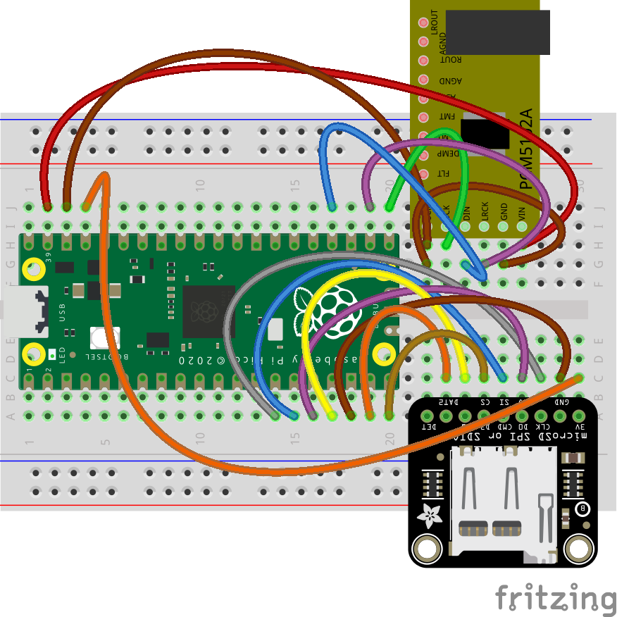

# `_core`

[](https://github.com/schollz/_core/actions/workflows/build.yml) [](https://github.com/schollz/_core/releases/latest)


this is the source code for *_core* music devices that utilize the rp2040. devices may differ, but the basic specification is as follows:

- mono or stereo playback of 16-bit (internal 32-bit) audio files @ 44.1 kHz sampling rate
- sd-card storage for audio + data
- recall up to 256 audio files (16 banks of 16 tracks)
- digital low-pass and high-pass filter
- basic single-cycle wavetable synthesizer
- realtime sequencer with optional quantization
- low-latency (<10 ms)

there are a few versions of the "*_core*" devices that utilize this firmware:

## boardcore

breadboard version (see [demo](https://www.instagram.com/p/CvzdZTYtV8H/)).

- [WeAct Raspberry Pi Pico (others should work too)](https://www.aliexpress.us/item/3256803521775546.html?gatewayAdapt=glo2usa4itemAdapt) ($2.50)
- [pcm5102](https://www.amazon.com/Comimark-Interface-PCM5102-GY-PCM5102-Raspberry/dp/B07W97D2YC/) ($9)
- [sdio sd card](https://www.adafruit.com/product/4682) ($3.50)




## zeptocore

hand-held version (see [demo](https://www.instagram.com/p/C1PFLGDvB9I/)).

<center>

</center>


### goals

the goal of this project is to produce a device that achieves compelling music without learning, though learning is rewarded.

### non-goals

a non-goal for this project is to be emulate a specific musical device. 

a non-goal for this project is audio synthesis. though I may change my mind about this.


### similar devices

if you like this device, you might also like:

- [joydrums](https://www.yzhkinstruments.com/download), as if a beat pad and a loop pedal had a baby.
- [bitty](https://www.curioussoundobjects.com/), an Arduino-compatible device that makes making music fun.
- [hss2020](http://gieskes.nl/instruments/?file=HSS2020), a trimmed down version of the hard soft synth that fits in the hands.
- [phantasmal force](https://www.tindie.com/products/distropolis/phantasmal-force-micro-midi-controller/), a micro midi controller.


### zeptocore spec (draft)

knobs: X, Y, Z

top buttons are **A**, **B**, **C**, and **D**.

the rest of the buttons (1-16) are just called **H**.


#### combo buttons


- [x] **H** + **H** → JUMP: retrig depending on location
- [x] **A** + **H** → JUMP: do fx (toggle), MASH/BASS: do jump
- [x] **A** + **B** → JUMP mode
- [x] **A** + **B** + **B** ... → set tempo via tapping
- [x] **A** + **C** → MASH mode
- [x] **A** + **D** → BASS mode
- [x] **B** → show bank (blinking) + sample (bright)
- [x] **B** + **H** + **H** → select bank (1st) + sample (2nd)
- [x] **B** + **C** → start/stop
- [x] **B** + **D** → mute
- [x] **C** → display which sequence is selected (bright)
- [x] **C** + **H** → select sequence (led dim or bright = used, led off or blinking = unused) 
- [x] **C** + **H** + **H** + **H** ... → chains sequences together, though the first selected must be empty
- [x] **C** + **B** → toggle play sequence
- [x] **C** + **D** → toggle record sequence
- [x] **C** + **D**, **C** + **D** → erase current sequence
- [x] **D** → shows current slot (blinking / bright) and slots with data (dim)
- [x] **D** + **H** → select save slot
- [x] **D** + **B** load from save slot
- [x] **D** + **C** → save into save slot


#### combo knobs

- [x] **A** + **X** → tempo
- [x] **A** + **Y** → pitch
- [x] **A** + **Z** → volume
- [ ] **B** + **X** → 
- [x] **B** + **Y** → filter fc (lowpass/highpass?)
- [ ] **B** + **Z** → 
- [ ] **C** + **X** → 
- [ ] **C** + **Y** → 
- [x] **C** + **Z** → quantize
- [ ] **D** + **X** → probability of jump
- [ ] **D** + **Y** → probability of retrigger
- [ ] **D** + **Z** → 
- [o] **H** + **X/Y/Z** -> in MASH mode this edits the parameters of the effect

#### effects 

there are 16 effects in four categories - "shape", "time", "space", and "pitch".
holding an effect and using a knob will change its parameters.

- [x] **1** -> warm (preamp postamp)
- [x] **2** -> loss (type+threshold, postamp)
- [x] **3** -> fuzz (preamp postamp)
- [x] **4** -> crush (frequency, bitdepth)
- [x] **5** -> reverse 
- [x] **6** -> stretch
- [x] **7** -> delay (delay feedback, delay length)
- [x] **8** -> repeat (repeat length)
- [x] **9** -> tighten (gate amount)
- [x] **10** -> heighten (tremelo speed, depth)
- [x] **11** -> circulate (pan speed, depth)
- [x] **12** -> scratch (scratch speed)
- [x] **13** -> lower (depth)
- [ ] **14** -> slower (duration, depth)
- [ ] **15** -> faster (duration, depth)
- [ ] **16** -> stop (duration)

#### cheat codes

- [x] **1**,**2**,**1** -> toggle variable splice playback
- [x] **4**,**5**,**4** -> toggle one-shot mode
- [ ] **6**,**7**,**6** -> toggle play mode
- [x] **5**, **8**, **7**, **6** -> toggle tempo match mode
- [x] **9**,**12**,**10**,**11** -> change resampling (linear or quadratic)
- [ ] ?? -> toggle sync mode?

#### needs

- probability jump
- probability retrig

# building image

## mac os x

First install homebrew:

```
/bin/bash -c "$(curl -fsSL https://raw.githubusercontent.com/Homebrew/install/master/install.sh)"
```

You will need to add Homebrew to your PATH. Do so by running the following two commands:

```
which brew
```

will tell you which path your brew is on. then

```
echo 'eval "$([path to homebrew from command above] shellenv)"' >> /Users/USERNAME/.zprofile (remembering to substitute your username)
eval "$(/opt/homebrew/bin/brew shellenv)"
```

Now you can install the toolchain:

```
brew install cmake python
brew tap ArmMbed/homebrew-formulae
brew install gcc-arm-embedded
```

Now clone the repo and install the Pico SDK

```
git clone https://github.com/schollz/_core
cd _core
export PICO_SDK_PATH=$(pwd)/pico-sdk
git clone -b master https://github.com/raspberrypi/pico-sdk.git
cd pico-sdk &&  git submodule update --init && cd ..
```

Now you should be able to build zeptocore:

```
make clean zeptocore
```

## windows

Install WSL 2

```
$ wsl --set-default-version 2
$ wsl --install Ubuntu
```

Then restart computer and run 

```
$ wsl --install
```

That should start your system. Then you can follow the Linux directions:

## linux

Install the pre-requisites:

```
sudo apt install cmake gcc-arm-none-eabi libnewlib-arm-none-eabi libstdc++-arm-none-eabi-newlib git python3 g++
sudo -H python3 -m pip install numpy matplotlib tqdm icecream librosa click
```

Clone this repo and install the Pico SDK:

```
git clone https://github.com/schollz/_core
cd _core
git clone https://github.com/raspberrypi/pico-sdk
cd pico-sdk &&  git submodule update --init && cd ..
export PICO_SDK_PATH=$(pwd)/pico-sdk
```

Do a build:

```
make clean zeptocore
```

(replace '`zeptocore`' with '`ectocore` or '`boardcore`'' if you are building the latter)

# building upload tool

## windows

First [install Scoop](https://scoop.sh/), open PowerShell terminal and type:

```PowerShell
> Set-ExecutionPolicy -ExecutionPolicy RemoteSigned -Scope CurrentUser
> Invoke-RestMethod -Uri https://get.scoop.sh | Invoke-Expression
```

Then in the Powershell:

```PowerShell
> scoop update
> scoop install go zig sox
```

Now you can build with:

```PowerShell
> cd core
> $env:CGO_ENABLED=1; $env:CC="zig cc"; go build -v -x
```

Now the upload tool can be run by typing

```
./core.exe
```

# license

- Apache License 2.0 for no-OS-FatFS (Copyright 2021 Carl John Kugler III)
- MIT license for the SdFat library (Copyright (c) 2011-2022 Bill Greiman)
